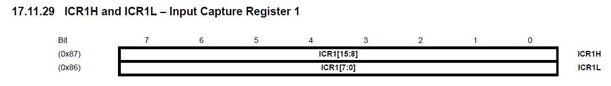

<head>
<link rel="stylesheet" href="main.css">
<head>

<body>
<h1>Servo Motor with Arduino Mega(Atmega2560)</h1>
<h2>Context</h2>
<strong>We will learn how a servo motor works, how to control servo motor using PWM timers</strong>

<section>
<h2>Contents</h2>
<ul  style="background-color:#c5d4cc;padding-top: 10px;padding-bottom: 10px;">
<li><a href="#comp"><h3>Components</h3></a></li>
<li><a href="#ckt"><h3>Ciruit Diagram</h3></a></li>
<li><a href="#pwm"><h3>About PWM</h3></a></li>
<li><a href="#servo"><h3>Working of Servo Motor</h3></a></li>
<li><a href="#code"><h3>Controlling Servo Motor</h3></a>
<ul>
<li><a href="#reg"><h4>Registers</h4></a></li>
<li><a href="#cal"><h4>Calculations</h4></a></li>
<ul>
</li>
</ul>
</section>

<section id="comp" style="margin-bottom:50px" >
<h2>Components</h2>
<table>
  <tr style="font-size: 24px;">
    <th>Component</th>
    <th>Quantity</th>
  </tr>
  <tr>
    <td><strong>Arduino Mega</strong></td>
    <td>1</td>
  </tr>
   <tr style="font-size: 24x;">
    <td><strong>Servo Motor</strong></td>
    <td>1</td>
  </tr>
   <tr style="font-size: 24x;">
    <td><strong>Jumper Wires</strong></td>
    <td>3</td>
  </tr>
</table>
</section>

<section id="ckt">
<h2>Circuit Diagram</h2>

<strong style="font-size:20px">
Here, Data pin of servo motor is connected to Pin 11 as it is used as Output compare A of Timer 1. 
</section>

<section id="pwm" style="margin-bottom:50px">
<h2>About PWM</h2>
<strong style="font-size:20px;">PWM (Pulse Width Modulation) is used to generate an analog output with digital signals. For example, you want to control the brightness of an LED, but your microcontrollers only sends high(+5V) or low (0V) signal, here PWM technique is used to control the brightness of LED.</strong>

<strong>Two Important things in PWM are 
1. Frequency  : Determines the how many cycles per second
2. Duty Cycle : It is the ratio of ON time to the total time

Let us take the above example of the LED, if the supply voltage to an LED is 5v, if the frequency is 1KHZ(1ms) and duty cycle is 50%, i.e In clock period of 1ms the LED remains ON for 0.5ms and OFF another for 0.5ms, so on an average LED recieves only 50% of supply voltage i.e 2.5v ,now brightness of LED is only 50%. You can change duty cycle as per the needs, to have a better resolution of duty cycle , you can increase the frequency.
 PWM is used in controlling the brighntess of lights, Speed of electric motor.
</strong>
</section>

<section  id="servo" style="margin-bottom:50px">
<h2>Working of Servo Motor </h2>
<strong style="font-size:20px;">
Servo Motor runs at frequeny of 50Hz and a clock period of 20ms. It works on the principle of PWM.  
For 1ms pulse servo rotates to 0 degrees, 1.5ms pulse servo rotates to 90 degrees, 2.5ms pulse servo rotates to 180 degrees.

</strong>
</section>

<section id="code" style="margin-bottom:50px">
<h2>Controlling Servo Motor</h2>
Here, We are using 16-bit Timer 1.
<h3 id="reg">Registers</h3>
we are using Fast PWM with top value as ICRn which is used to set the frequency. We can select waveform generation mode in Control Regsiter A and B.

In Control Register A, we set the Waveform generation bits WGM11,WGM10 and PWM mode using COM1A1 and COM1A2.

we set  COM1A1-1, COM1A2-0, this way servo will be ON from 0 to the value we set in OCR1A register.

In control register B,we set the Waveform generation bits WGM12,WGM13 and pre-scaler bits CS12,CS11,CS10.

ICR1 register is used to set the frequency.

OCR1A register value decides the duty cycle.
 

<h3 id="cal">Calculations</h3>
<h4>Frequency</h4>
We need to set the frequency to 50Hz, clock frequency is 16Mhz.
we can set the frequency to 50Hz by using Pre-scaler and ICR1 register. 
Servo frequency = 16Mhz/8*40000 
Here 16Mhz is the clock frequency, 8 is the pre-scaler you can set that in register B and 40000 is value in the register OCR1A.

<h4>Duty Cycle</h4>
As you read earlier, servo rotates between 0 to 180 degrees with a clock pulse between 1ms(0 degrees) to 2ms(degrees).  

Duty cycle for 0 degrees = (1ms/20ms)*100 = 5% 

To set Duty cycle In register OCR1A 
OCR1A = 5% of 40000(OCR1A) = 2000

Duty cycle for 180 degrees = (2ms/20ms)*100 = 12.5%  
OCR1A = 12.5% of 40000(OCR1A) = 5000

so, to move from 0 to 180 degrees, we need a duty cycle from 5% to 12.5% i.e OCR1A register values from 2000 to 5000

Servo will rotate from 0 degrees to 180 degrees.
</section>
</body>
